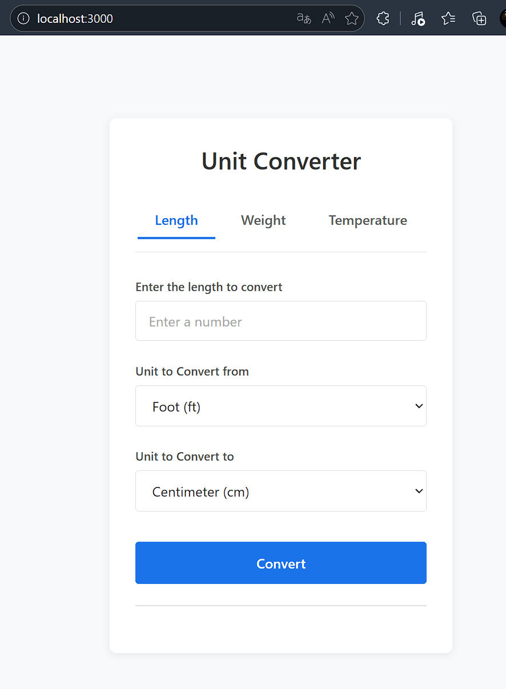
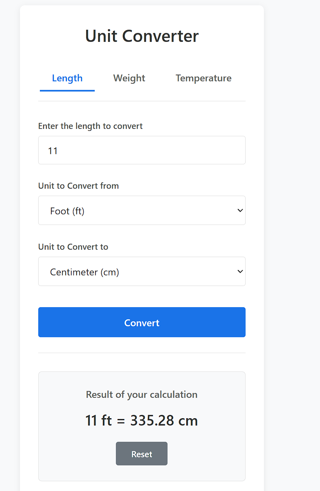

# Web-Unit-Converter

## Intro
This is backend pratice project. Detail Please visit Roadmap.
https://roadmap.sh/projects/unit-converter

## Menu structure

- [Intro](#Intro)
- [Setup](#Setup)
- [Project](#Project)
- [Requirement](#Requirement)
- [FileStatement](#FileStatement)
- [Start](#Start)
- [Usage](#Usage)
- [Contribute](#Contribute)
- [Lisence](#Lisence)


## Setup
https://nodejs.org/zh-cn/download
Use cmd command to check if Node.js and npm are installed:
```cmd
node --version 
npm --version
```

## Project
A simple web app that can convert between different units of measurement. It can convert units of length, weight, volume, area, temperature, and more. The user can input a value and select the units to convert from and to. The application will then display the converted value.

### Requirements
The user can input a value to convert, select the units to convert from and to, and view the converted value:
+ The user can input a value to convert.
+ The user can select the units to convert from and to.
+ The user can view the converted value.
+ The user can convert between different units of measurement like length, weight, temperature, etc (more given below).


### FileStatement
- server.js      (web project's backend code file, calculating the converted value after user input at frontend's unit)
- package.json   (This project envirnment json file)
- README.md      (Project statement)
- public         (File that included code files "index.html" and "script.js")
- index.html     (HTML and CSS web display format code file)
- script.js      (frontend code file. Deal with usrer at web's interaction and transport input value and unit to backend to calculate)
- LICENSE        (MIT license of project)
- node_modules   (Project envirnment package using Node.js)


### Start
```bash
npm start
# Using NPM package manger and package.js start project
# display: "Unit Converter app listening at http://localhost:3000"

# Copty link "http://localhost:3000" to web and using this project's unit converter
```

### Usage
Example: Using convert length unit: (Foot->Centimeter). Left picuter is original project web format, right is length converted result after click "Convert" button:
<div align="center">


</div>

### Task Properties
Convert unit included:
- Length: millimeter, centimeter, meter, kilometer, inch, foot, yard, mile.
- Weight: milligram, gram, kilogram, ounce, pound.
- Temperature: Celsius, Fahrenheit, Kelvin.
- There is not any dataset for this project.


## Contribute
yilinDai (GitHub name: itoeHi, email:daiyilin1425251132@qq.com)

## Lisence
MIT lisence
